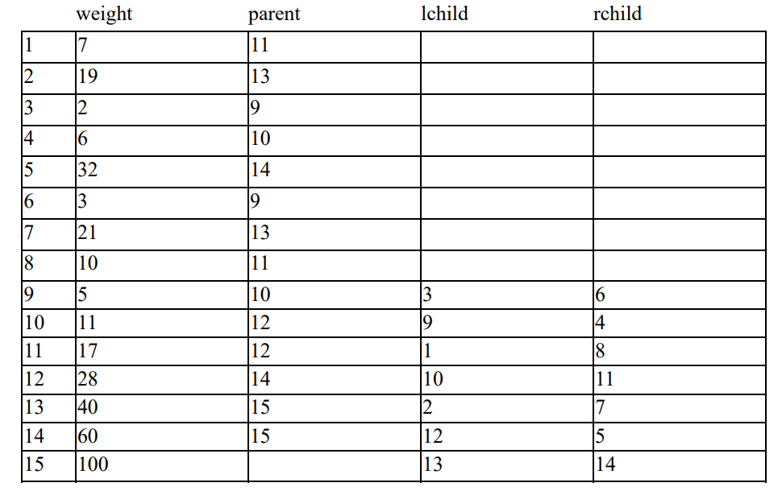
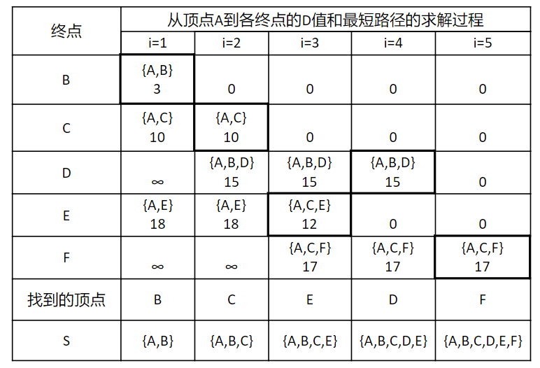
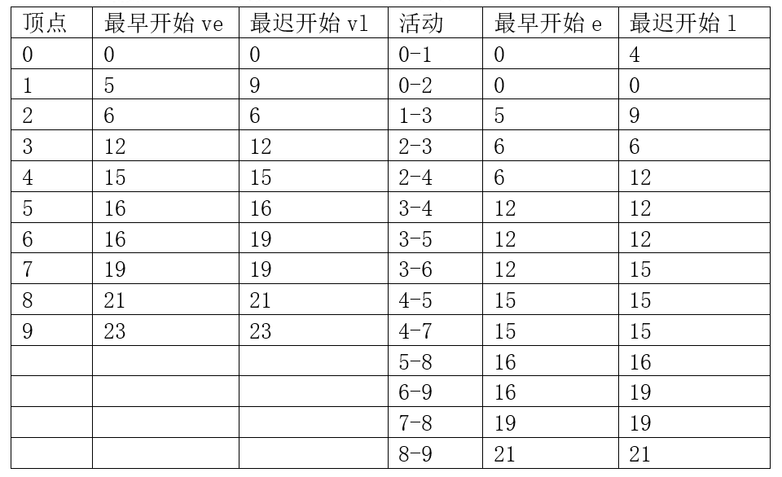
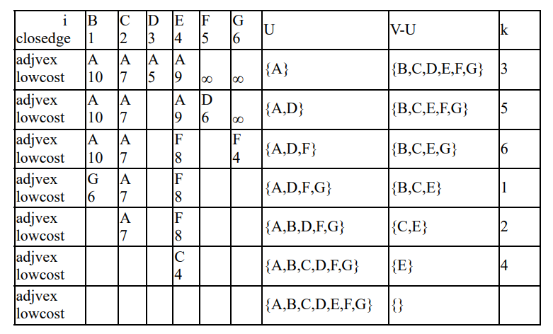

# exam2 - 参考答案

## 客观题
1. B
2. A
3. B
4. D
5. D
6. B
7. C
8. C
9. B
10. D
11. C
12. D
13. B
14. A
15. B
16. C
17. D
18. D
19. D
20. A

## 程序填空题
1. 1. `T=NULL`
   2. `T->data=ch`
   3. `T->lchild`
   4. `T->rchild`
2. 1. `visited[v]=TRUE`
   2. `EnQueue(Q, v)`
   3. `!QueueEmpty(Q)`
   4. `DeQueue(Q, u)`
   5. `w=NextAdjVex(G, u, w)`
   6. `visited[w]=TRUE`
   7. `EnQueue(Q, w)`

## 主观题

### Problem 1

叶子结点数 = 2<sup>6</sup> - 2 + 4 = 66

总结点数 = 2<sup>0</sup> + 2<sup>1</sup> + ... + 2<sup>6</sup> + 4 = 131

### Problem 2
(1) 该程序的功能是求用邻接表表示的图中的每个节点的入度；

(2) `D[]={0, 2, 1, 2, 2};`


### Problem 3
深度优先搜索序列: `d, b, a, c, h, g, f, e`

广度优先搜索序列: `d, b, c, e, f, g, h, a`

### Problem 4
后序遍历序列: `FEMNLKGSPHDCBA`

层序遍历序列: `ABECFGDKHLPMNS`

### Problem 5

```
A: 1010
B: 00
C: 10000
D: 1001
E: 11
F: 10001
G: 01
H: 1011
```
WPL = 2(19+21+32)+4(6+7+10)+5(2+3) = 261

### Problem 6


|A到|路径长度为|
|:-:|:-:|
|B|3|
|C|10|
|D|15|
|E|12|
|F|17|

### Problem 7


最少需要 `23` 个小时，当活动 `0-2, 2-3, 8-9` 提前完成时，整个项目可以提前完工。

### Problem 8


最小生成树上的边为 `{<A,D>,<D,F>,<F,G>,<G,B>,<A,C>,<C,E>}`

### Problem 9
```c++
typedef int ElemType;
typedef struct Node{
  ElemType data;
  struct Node *firstchild, *nextsibling;
}TNode, *Tree;

void PrintIt(Tree T){
  if(T){
		printf("%d\n", T->data);
	  PrintIt(T->firstchild);
		PrintIt(T->nextsibling);
	}
}

Tree FindNode(Tree T, VertexType u){
  if(T){
    Tree ret;
		if(T->data == u) return T;
	  if(ret = FindNode(T->firstchild)) return ret;
		if(ret = FindNode(T->nextsibling)) return ret;
	}
  return NULL;
}

void PrintChildren(Tree T, VertexType u){
  Tree target = FindNode(T, u);
  PrintIt(target);
}
```