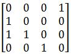
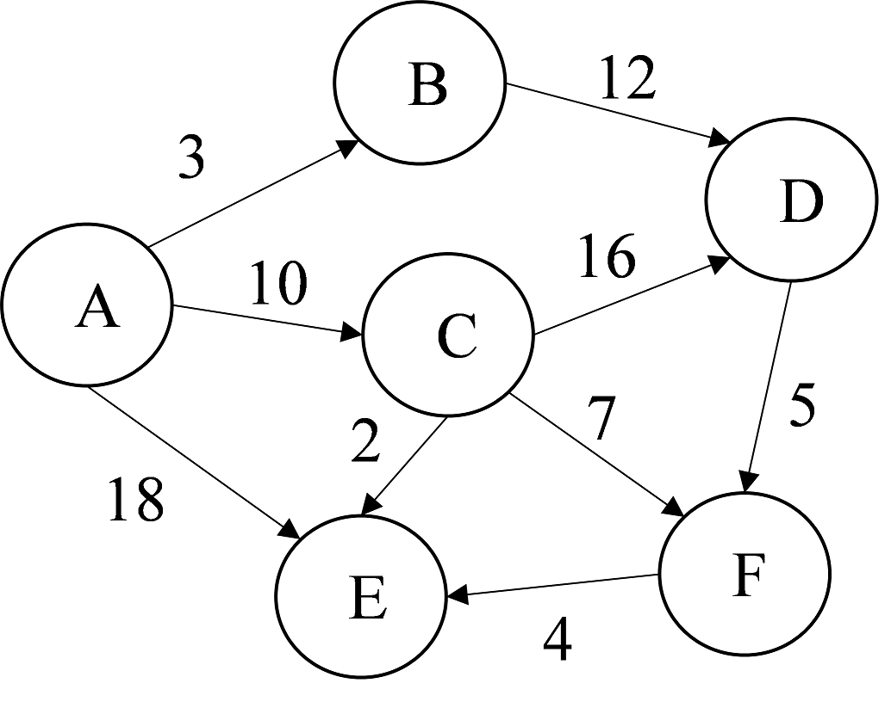

# exam2

参考答案在 [ANSWERS.md](ANSWERS.md) 中。

<!-- TOC -->

- [客观题](#客观题)
- [程序填空题](#程序填空题)
  - [Problem 1](#problem-1)
  - [Problem 2](#problem-2)
- [主观题](#主观题)
  - [Problem 1](#problem-1-1)
  - [Problem 2](#problem-2-1)
  - [Problem 3](#problem-3)
  - [Problem 4](#problem-4)
  - [Problem 5](#problem-5)
  - [Problem 6](#problem-6)
  - [Problem 7](#problem-7)
  - [Problem 8](#problem-8)
  - [Problem 9](#problem-9)

<!-- /TOC -->

## 客观题

1. 已知二叉树的前序遍历序列为 `ABDCEFG` ，中序遍历序列为 `DBCAFEG` ，则后序遍历序列为  
    A. `BDACEFG`  
    B. `DCBFGEA`  
    C. `ABCDEFG`  
    D. `GFEDCBA`

2. 在一棵度为 `3` 的树中，度为 `2` 的结点个数是 `1` ，度为 `0` 的结点个数是 `6` ，则度为 `3` 的结点个数是  
    A. `2`  
    B. `3`  
    C. `4`  
    D. 无法确定

3. 二叉树是非线性数据结构，_______。  
    A. 顺序结构和链式结构都不能使用  
    B. 顺序存储结构和链式存储结构都能存储  
    C. 不能用顺序存储结构存储  
    D. 不能用链式存储结构存储

4. 树最适合用来表示  
    A. 无序数据元素  
    B. 有序数据元素  
    C. 元素之间无联系的数据  
    D. 元素之间具有层次关系的

5. 设深度为 `h` 的二叉树中只有度为 `0` 和度为 `2` 的结点，则此类二叉树中所包含结点数至多  
    A. 2<sup>h-1</sup>  
    B. 2<sup>h</sup>+1  
    C. 2<sup>h+1</sup>-1  
    D. 2<sup>h</sup>-1

6. 已知一棵有 `2011` 个结点的树，其叶节点个数为 `116` ，该树对应的二叉树中无右孩子的结点个数是  
    A. `1895`  
    B. `1896`  
    C. `115`  
    D. `116`

7. 将一棵有 `100` 个结点的完全二叉树从根这一层开始，每一层从左到右依次对结点进行编号，根结点编号为 `1` ，则编号最大的非叶结点的编号为  
    A. `48`  
    B. `49`  
    C. `50`  
    D. `51`

8. 如果 `G` 是一个有 `28` 条边的非连通无向图，那么该图顶点个数最少为  
    A. `7`  
    B. `8`  
    C. `9`  
    D. `10`

9. 设无向图为 `G=(V, E)` ，其中 `V={v1,v2,v3,v4}, E={(v1,v2), (v3,v4), (v4,v1), (v2,v3), (v1,v3)}` 。则相应的邻接矩阵为  
    A.   
    B.   
    C.   
    D. 

10.  已知一个无向图的顶点集为 {V<sub>​0</sub>, V<sub>1</sub>, ..., V<sub>7</sub>}，其邻接矩阵如下所示:  
      
    以下哪项不可能是从 V<sub>0</sub> 出发的深度优先遍历序？   
    A. V<sub>0</sub>, V<sub>1</sub>, V<sub>2</sub>, V<sub>5</sub>, V<sub>4</sub>, V<sub>6</sub>, V<sub>3</sub>, V<sub>7</sub>  
    B. V<sub>0</sub>, V<sub>3</sub>, V<sub>6</sub>, V<sub>7</sub>, V<sub>4</sub>, V<sub>1</sub>, V<sub>2</sub>, V<sub>5</sub>  
    C. V<sub>0</sub>, V<sub>4</sub>, V<sub>1</sub>, V<sub>2</sub>, V<sub>5</sub>, V<sub>6</sub>, V<sub>7</sub>, V<sub>3</sub>  
    D. V<sub>0</sub>, V<sub>1</sub>, V<sub>4</sub>, V<sub>3</sub>, V<sub>6</sub>, V<sub>7</sub>, V<sub>2</sub>, V<sub>5</sub>

11.   设有图的数据逻辑结构 `B=(K,R)` ，其中顶点集 `K={k1, k2, ..., k9}` ，有向边集 `R={<k1,k3>, <k1,k8>, <k2,k3>, <k2,k4>, <k2,k5>, <k3,k9>, <k5,k6>, <k8,k9>, <k9,k7>, <k4,k7>, <k4,k6>}` 。以下哪个选项不是对应DAG图的拓扑序列？  
    A. `k1, k2, k3, k4, k5, k6, k8, k9, k7`  
    B. `k2, k5, k1, k4, k6, k8, k3, k9, k7`  
    C. `k2, k4, k5, k6, k7, k1, k3, k8, k9`  
    D. `k1, k8, k2, k3, k9, k4, k7, k5, k6`

12.  对如图所示的二叉树中序线索化，结点 `c` 的左指针与结点h的右指针分别指向  
      
    A. `a, c`  
    B. `h, g`  
    C. `g, c`  
    D. `a, g`

13. 具有n个顶点的有向完全图有 () 条弧。  
    A. `n(n-1)/2`  
    B. `n(n-1)`  
    C. `n(n+1)/2`  
    D. `n(n+1)`

14. 一个有向图中，共有 `n` 条弧，则所有顶点的度的总和为  
    A. `2n`  
    B. `n`  
    C. `n-1`  
    D. `n/2`

15. 若具有 `n` 个顶点的无向图采用邻接矩阵存储方法,该邻接矩阵一定是  
    A. 一般矩阵  
    B. 对称矩阵  
    C. 对角矩阵  
    D. 稀疏矩阵

16. 关键路径是AOE网中_______。  
    A. 从始点到终点的最短路径  
    B. 从始点到终点的边数最多的路径  
    C. 从始点到终点的最长路径  
    D. 从始点到终点的边数最少

17. 具有 `n` 个顶点的连通图的生成树一定有___条边。  
    A. `n`  
    B. `2n`  
    C. `n+1`  
    D. `n-1`

18. 二叉树的先序遍历序列和后序遍历序列正好相反，则该二叉树  
    A. 任一结点无左孩子  
    B. 空或只有一个结点  
    C. 任一结点无右孩子  
    D. 高度等于其结点数

19.  非递归中序遍历（有空指针进栈）含有 `n` 个结点高度为 `h` 的二叉树时，为了确保栈在处理过程中不会发生上溢，则该栈至少要有___个存储单元。  
    A. `n`  
    B. `n+1`  
    C. `h`  
    D. `h+1`

20. 在求边稠密的图的最小代价生成树时，采用___算法较合适。  
    A. 普里姆 (Prim)  
    B. 克鲁斯卡尔 (Kruskal)  
    C. 迪杰斯特拉 (Dijkstra)  
    D. 弗洛伊德 (Floyd)

## 程序填空题

### Problem 1
输入带 `$` 的先序序列，本题目要求建立二叉树。 `$` 表示空树。
```c++
typedef  struct  BiTNode
{  TElemType data;
   struct BiTNode *lchild, *rchild;   //左右孩子指针
} BiTNode, *BiTree;

Status CreateBiTree(BiTree &T)
{  char ch;
  scanf("%c",&ch);                   
  if (ch=='$') ____1____;
  else
   { T=(BiTNode*)malloc(sizeof(BiTNode)) ;
     if(!T) exit(OVERFLOW);
     ____2____;
     CreateBiTree(____3____);
     CreateBiTree(____4____);
  }
 return OK;
}
```

### Problem 2
假设图采用邻接表存储结构，本题目要求实现图的广度优先遍历算法。
```c++
typedef char VertexType[10];
typedef struct ArcNode
{int  adjvex;        // 该弧所指向的顶点的位置
 struct ArcNode *nextarc;  // 指向下一条弧的指针
 int info;           // 该弧相关信息
}ArcNode;
typedef struct VNode
{ VertexType data;    // 顶点信息
  ArcNode *firstarc;  // 指向第一条依附顶点的弧的指针
}VNode, AdjList[MAX_VERTEX_NUM];
typedef struct
{  AdjList vertices;
   int vexnum, arcnum;     // 图的当前顶点数和弧数
   int kind;               // 图的种类标志
} ALGraph;

int visited[MAX_VERTEX_NUM];
void BFSTraverse(ALGraph G)
{ 
 int v,u,w;
 SqQueue Q;
 for(v=0; v<G.vexnum; ++v ) visited[v] = FALSE;
 InitQueue(Q);                                 
 for (v=0; v<G.vexnum; ++v )
   if (!visited[v])
    {____1____;
    printf("%s ",G.vertices[v].data);   //访问第v个顶点
    ____2____;   // v入队列
    while ( ____3____ )
      {____4____;                     
        for(w=FirtAdjVex(G,u);w>=0;____5____)
          if(!visited[w])
            {____6____;
            printf("%s ",G.vertices[w].data);          
            ____7____;
            }               
      }
    }
}
```

## 主观题

### Problem 1
已知一棵树深为 `8` 的完全二叉树第 `8` 层有 `4` 个结点，请计算出其叶子结点数和总结点数。

### Problem 2
阅读下列算法并回答问题:
```c++
void Func(ALGraph G, int D[ ]) 
{    for(k=0;k<G.vexnum;k++)
       { p=G.vertices[k].firstarc;
         while(p)
            {  D[p->adjvex]++;   p=p->nextarc;
            }
      }
}
```
(1) 该程序的功能是什么?  
(2) 给定 `G=(V,A), V={v1,v2,v3,v4,v5}, A={<v1,v2>, <v1,v3>, <v1,v5>, <v3,v2>, <v3,v4>, <v4,v5>, <v5,v4>}` ，请问数组 `D` 中各元素值分别是多少？ 

### Problem 3
已知图 `G` 的邻接表如下图所示，请给出从顶点 `d` 出发的深度优先搜索序列和广度优先搜索序列。


### Problem 4
请将下图所示的树转换为对应的二叉树后，请给出二叉树的后序和层序遍历序列。


### Problem 5
假设用于通信的电文仅由 `A, B, C, D, E, F, G, H` 这8个字母组成，字母在电文中出现的频率为 `7, 19, 2, 6, 32, 3, 21, 10` ，请填写如下表格，构造赫夫曼树，写出赫夫曼编码，同时求相应赫夫曼树的带权路径长度 `WPL` 。不需要画出赫夫曼树。


### Problem 6
给定有向图如下，求顶点 `A` 到其余各顶点的最短路径。要求填写相关表格，写出 `A` 到其余各顶点的最短路径及路径长度。

  


### Problem 7
给定了一个项目的AOE，请填写表格计算整个项目最早完工需要的时间。除填表外，需要写出项目最少需要的时间，并说明哪一个活动提前完成，整个项目就能提前完工。

  


### Problem 8
给定如下图所示的无向网，请按Prim算法找出从 `A` 出发求其最小生成树。需要填写表格，并列出最小生成树上的边。

  


### Problem 9
假设二叉树用二叉链表表示，编写算法，输出一棵二叉树中顶点 `u` 的所有子孙。