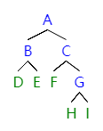

# week5 - 程序填空题和主观题参考答案

## 程序填空题
1. 1. `SElemType *base`
   2. `SElemType *top`
   3. `s.top = s.base`
   4. `STACK_INIT_SIZE`
   5. `s.top == s.base`
   6. `*(s.top - 1)`
   7. `s.stacksize`
   8. `*s.top++ = e`
   9. `s.top == s.base`
   10. `*(--s.top)`
   11. `s.top == s.base`

## 主观题

### Problem 1
```
m = n+1
  = 1×8+2×5+3×3+4×2+1
  = 36
m(>=1) = 8+5+3+2 = 18
m0 = m - m(>=1) = 36 - 18 = 18
```
### Problem 2


### Problem 3
```c++
#include <cstdio>
#include <cstdlib>

typedef int ElemType;

typedef struct BiTNode {
	ElemType data;
	struct BiTNode *left, *right;
} BiTNode, *BiTree;

bool createBiTree(BiTree &src){
	int in;
	scanf("%d", &in);
	if(in == -1){
		src = NULL;
	}else{
		src = (BiTNode *)malloc(sizeof(BiTNode));
		src->data = in;
		createBiTree(src->left);
		createBiTree(src->right);
	}
	return true;
}

int countLeaves(BiTree tree){
	int flag = 0;
	if(tree){
		if(!tree->left && !tree->right){
			flag = 1;
		}
		return countLeaves(tree->left) + countLeaves(tree->right) + flag;
	}
	return 0;
}

int main(){
	BiTree tree;
	createBiTree(tree); // 1 2 3 -1 -1 4 5 -1 6 -1 -1 7 -1 -1 -1
	printf("%d", countLeaves(tree));
	return 0;
}
```