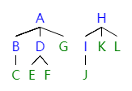

# week6 - 程序填空题和主观题参考答案

## 程序填空题
1. 1. `QElemType *`
   2. `int`
   3. `int`
   4. `(QElemType *)malloc(MAXQSIZE * sizeof(QElemType))`
   5. `0`
   6. `0`
   7. `(Q.rear - Q.front + MAXQSIZE) % MAXQSIZE`
   8. `(Q.rear + 1) % MAXQSIZE == Q.front`
   9. `Q.base[Q.rear]`
   10. `Q.rear = (Q.rear + 1) % MAXQSIZE`
   11. `Q.front == Q.rear`
   12. `Q.base[Q.front]`
   13. `Q.front = (Q.front + 1) % MAXQSIZE`
   14. `Q.front == Q.rear`
2. 1. `QueuePtr`
   1. `QueuePtr`
   2. `(QueuePtr)malloc(sizeof(QNode))`
   3. `Q.front->next = NULL`
   4. `free(Q.front)`
   5. `Q.rear`
   6. `Q.front`
   7. `p != Q.rear`
   8. `p = p->next`
   9.  `Q.rear->next = p`
   10. `p`
   11. `Q.front == Q.rear`
   12. `p->data`
   13. `Q.front->next = p->next`
   14. `Q.rear == p`
   15. `Q.front == Q.rear`

## 主观题

### Problem 1


### Problem 2
||weight|parent|lchild|rchild|
|-|-|-|-|-|
|1|5|6|0|0|
|2|15|7|0|0|
|3|40|9|0|0|
|4|30|8|0|0|
|5|10|6|0|0|
|6|15|7|1|5|
|7|30|8|2|6|
|8|60|9|4|7|
|9|100|0|3|8|

最少需要 `21500` 次比较。

### Problem 3
```c++
typedef int ElemType;
typedef struct Node {
	ElemType data;
	struct Node *firstchild, *nextsibling;
} Node, *Tree;

bool countLeaves(Tree src, int &dst){
	if(src){
		if(!src->firstchild) dst++;
		countLeaves(src->firstchild, dst);
		countLeaves(src->nextsibling, dst);
		return true;
	}
	return false;
}
```

### Problem 4
```c++
#include <cstdio>
#include <cstdlib>
#include <queue>

typedef int ElemType;

typedef struct BiTNode {
	ElemType data;
	struct BiTNode *left, *right;
} BiTNode, *BiTree;

bool createBiTree(BiTree &src){
	int in;
	scanf("%d", &in);
	if(in == -1){
		src = NULL;
	}else{
		src = (BiTNode *)malloc(sizeof(BiTNode));
		src->data = in;
		createBiTree(src->left);
		createBiTree(src->right);
	}
	return true;
}

bool preTraverse(BiTree T, std::queue<ElemType> &result){
	if(T){
		result.push(T->data);
		preTraverse(T->left, result);
		preTraverse(T->right, result);
		return true;
	}
	return false;	
}

bool midTraverse(BiTree T, std::queue<ElemType> &result){
	if(T){
		preTraverse(T->left, result);
		result.push(T->data);
		preTraverse(T->right, result);
		return true;
	}
	return false;
}

bool equal(BiTree T1, BiTree T2){
	std::queue<ElemType> resultT1, resultT2;
	preTraverse(T1, resultT1);
	preTraverse(T2, resultT2);
	while(!resultT1.empty() && !resultT2.empty()){
		if(resultT1.front() != resultT2.front()) return false;
		resultT1.pop();
		resultT2.pop();
	}
	if(!resultT1.empty() || !resultT2.empty()) return false;
	midTraverse(T1, resultT1);
	midTraverse(T2, resultT2);
	while(!resultT1.empty() && !resultT2.empty()){
		if(resultT1.front() != resultT2.front()) return false;
		resultT1.pop();
		resultT2.pop();
	}
	if(!resultT1.empty() || !resultT2.empty()) return false;
	return true;
}

int main(){
	BiTree tree1, tree2;
	createBiTree(tree1); // 1 2 3 -1 -1 4 5 -1 6 -1 -1 7 -1 -1 -1
	createBiTree(tree2); // 1 2 3 -1 -1 4 5 -1 6 -1 -1 7 -1 -1 -1
	printf("%d", equal(tree1, tree2));
	return 0;
}
```