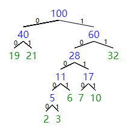
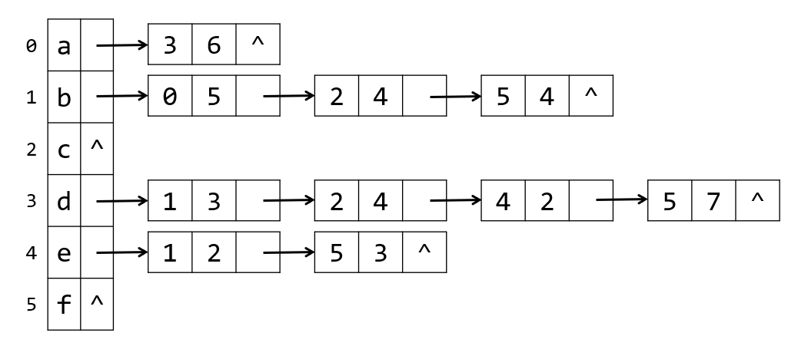

# week7 - 程序填空题和主观题参考答案

## 程序填空题
1. 1. `!StackEmpty(S)`
   2. `Push(S,p);p=p->lchild;`
   3. `Pop(S,p);`
   4. `p=p->rchild`

## 主观题

### Problem 1
这8个字母的权可记为 `7, 19, 2, 6, 32, 3, 21, 10`

可画表格如下:
||weight|parent|lchild|rchild|
|-|-|-|-|-|
|1|7|11|0|0|
|2|19|13|0|0|
|3|2|9|0|0|
|4|6|10|0|0|
|5|32|14|0|0|
|6|3|9|0|0|
|7|21|13|0|0|
|8|10|11|0|0|
|9|5|10|3|6|
|10|11|12|9|4|
|11|17|12|1|8|
|12|28|14|10|11|
|13|40|15|2|7|
|14|60|15|12|5|
|15|100|0|13|14|

可画哈夫曼树如下:  

得到哈夫曼编码如下:  
{1010, 00, 10000, 1001, 11, 10001, 01, 1011}

### Problem 2
(1)
|结点|入度|出度|
|-|-|-|
|a|1|1|
|b|2|3|
|c|2|0|
|d|1|4|
|e|1|2|
|f|3|0|

(2)
||a|b|c|d|e|f|
|-|-|-|-|-|-|-|
|a|∞|∞|∞|6|∞|∞|
|b|5|∞|4|∞|∞|4|
|c|∞|∞|∞|∞|∞|∞|
|d|∞|3|4|∞|2|7|
|e|∞|2|∞|∞|∞|3|
|f|∞|∞|∞|∞|∞|∞|

(3)

### Problem 3
DFS遍历序列如下:  
`1, 7, 3, 4, 5, 6, 2, 10, 9, 8`