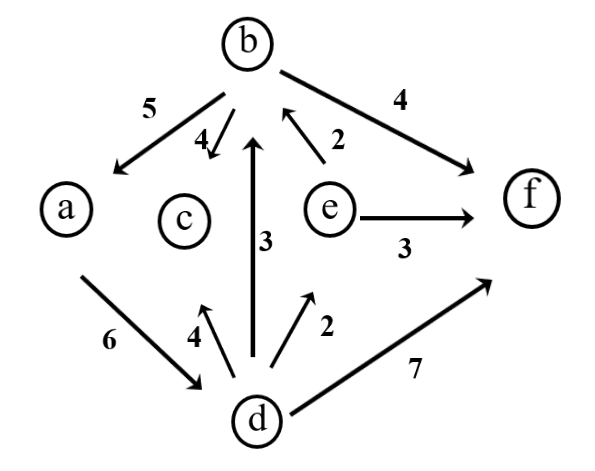
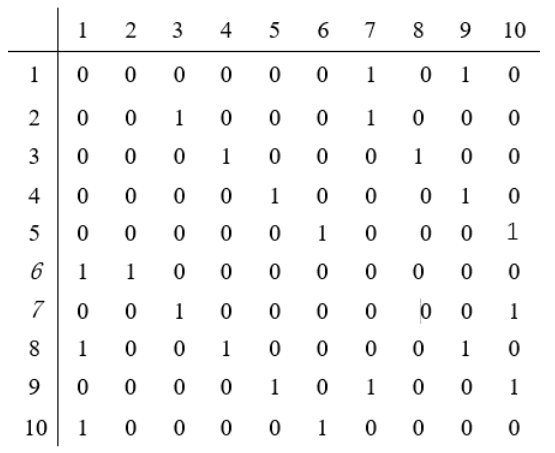

# week7

程序填空题及主观题参考答案在 [ANSWERS.md](ANSWERS.md) 中，编程题参考答案为同目录下的 `.cpp` 文件。

<!-- TOC -->

- [程序填空题](#程序填空题)
  - [Problem 1](#problem-1)
- [编程题](#编程题)
  - [7.1 二叉树建立1](#71-二叉树建立1)
  - [7.2 子孙关系判断](#72-子孙关系判断)
  - [7.3 二叉树建立2](#73-二叉树建立2)
  - [7.4 根到结点的路径](#74-根到结点的路径)
- [主观题](#主观题)
  - [Problem 1](#problem-1-1)
  - [Problem 2](#problem-2)
  - [Problem 3](#problem-3)

<!-- /TOC -->

## 程序填空题

### Problem 1
本题目要求实现非递归中序遍历算法。
```c++
Status InOrderTraverse(BiTree T,Status(*Visit)(BiTree e))
{ //采用二叉链表存储结构
   //中序历遍二叉树T的非递归算法，对每个数据元素调用函数Visit。
 SqStack S;
 BiTree p;
 InitStack(S);
 p=T;
 while(p || ____1____ )
 {  if(p)
       { ____2____ }   //根指针进栈, 历遍左子树
    else
        { ____3____    //根指针退栈，访问结点，历遍右子树
          (*Visit)(p);
         ____4____;
        }//else
 }
 return OK;
}
```

## 编程题

### 7.1 二叉树建立1
已知先序序列，建立一棵二叉树，输出后序遍历序列，并计算这棵二叉树的高度。

输入格式:  
输入在一行中给出二叉树的先序序列。 `*` 表示空格

输出格式:  
输出共二行，第一行是二叉树的后序遍历序列，第二行是二叉树的高度。

输入样例:
```
ABC**DE*G**F***
```
输出样例:
```
CGEFDBA
5
```

### 7.2 子孙关系判断
已知二叉树的先序序列，判断结点 `u` 是否是结点 `v` 的子孙，是就输出 `v` 到 `u` 的路径长度，否则输出 `NO` 。假设结点个数少于 `50` 个。

输入格式:  
输入共二行，第一行中给出先序序列，第二行给出两个顶点。 `*` 表示空树。

输出格式:  
输出一个整数或 `NO` 。

输入样例1:
```
ABC**DE*G**F***
BE
```
输出样例1:
```
2
```
输入样例2:
```
ABC**DE*G**F***
CE
```
输出样例1:
```
NO
```

### 7.3 二叉树建立2
已知非空的二叉树的先序序列和中序序列，建立这棵二叉树的二叉链表，输出后序序列并计算二叉树中左子树的结点个数。假设树的结点个数不超过 `26` 个。

输入格式:  
输入共二行，分别给出非空的二叉树的先序序列和中序序列。

输出格式:  
输出也是二行，第一行输出二叉树的后序序列，第二行输出二叉树中左子树的结点个数。

输入样例:
```
ABCDEGF
CBEGDFA
```
输出样例:
```
CGEFDBA
6
```

### 7.4 根到结点的路径
利用二叉树后序遍历算法，输出从根到某个结点的路径。输入是二叉树的先序序列，输出是路径上的结点。

输入样例:
```
ABC**DE*G**F***
E
```
输出样例:
```
the path is:E<-D<-B<-A
```

## 主观题

### Problem 1
假设用于通信的电文仅由8个字母组成，字母在电文中出现的频率为 `0.07, 0.19, 0.02, 0.06, 0.32, 0.03, 0.21, 0.10` ，试为这8个字母设计哈夫曼编码。要求画出类似书上图6.27(b)的表格和对应的哈夫曼树。

### Problem 2
已知如下图所示的有向图，请给出该图的  
(1) 每个顶点的入/出度；  
(2) 邻接矩阵；  
(3) 邻接表。



### Problem 3
已知以二维数组表示的图的邻接矩阵如下图所示，试给出从顶点1出发进行深度优先遍历所得的遍历序列。

