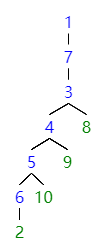
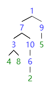
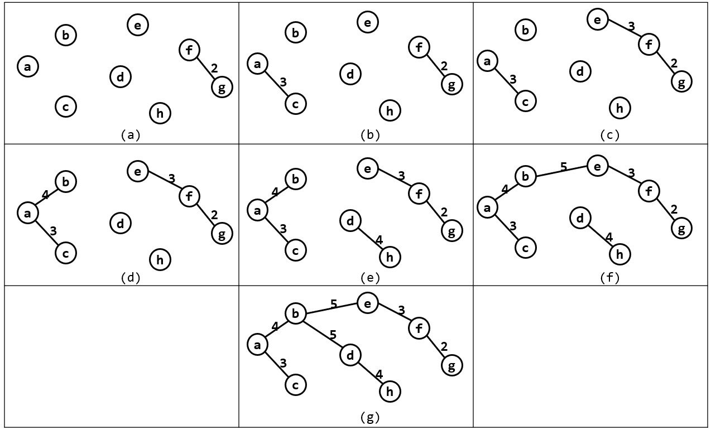

# week8 - 主观题参考答案

### Problem 1

深度优先生成树:



广度优先生成树:



### Problem 2

(1)

该图的邻接矩阵如下

|       | **a** | **b** | **c** | **d** | **e** | **f** | **g** | **h** |
| ----- | ----- | ----- | ----- | ----- | ----- | ----- | ----- | ----- |
| **a** | ∞     | 4     | 3     | ∞     | ∞     | ∞     | ∞     | ∞     |
| **b** | 4     | ∞     | 5     | 5     | 5     | ∞     | ∞     | ∞     |
| **c** | 3     | 5     | ∞     | 5     | ∞     | ∞     | ∞     | 5     |
| **d** | ∞     | 5     | 5     | ∞     | 7     | 6     | 5     | 4     |
| **e** | ∞     | 5     | ∞     | 7     | ∞     | 3     | ∞     | ∞     |
| **f** | ∞     | ∞     | ∞     | 6     | 3     | ∞     | 2     | ∞     |
| **g** | ∞     | ∞     | ∞     | 5     | ∞     | 2     | ∞     | 6     |
| **h** | ∞     | ∞     | 5     | 4     | ∞     | ∞     | 6     | ∞     |

根据邻接矩阵，画出类似书上7.17的表格如下

| **i**<br>**closedge**       | **1**   | **2**   | **3**   | **4**   | **5**   | **6**   | **7**   | **U**             | **V-U**         | **k** |
| --------------------------- | ------- | ------- | ------- | ------- | ------- | ------- | ------- | ----------------- | --------------- | ----- |
| **adjvex**<br/> **lowcost** | a<br>4  | a<br/>3 |         |         |         |         |         | {a}               | {b,c,d,e,f,g,h} | 2     |
| **adjvex**<br/> **lowcost** | a<br/>4 | <br/>0  | c<br/>5 | c<br/>5 |         |         |         | {a,c}             | {b,d,e,f,g,h}   | 1     |
| **adjvex**<br/> **lowcost** | <br/>0  | <br/>0  | c<br/>5 | c<br/>5 | b<br>5  |         |         | {a,c,b}           | {d,e,f,g,h}     | 3     |
| **adjvex**<br/> **lowcost** | <br/>0  | <br/>0  | <br/>0  | d<br/>4 | b<br/>5 | d<br/>6 | d<br/>5 | {a,c,b,d}         | {e,f,g,h}       | 4     |
| **adjvex**<br/> **lowcost** | <br/>0  | <br/>0  | <br/>0  | <br/>0  | b<br/>5 | d<br/>6 | d<br/>5 | {a,c,b,d,h}       | {e,f,g}         | 5     |
| **adjvex**<br/> **lowcost** | <br/>0  | <br/>0  | <br/>0  | <br/>0  | <br/>0  | e<br/>3 | d<br/>5 | {a,c,b,d,h,e}     | {f,g}           | 6     |
| **adjvex**<br/> **lowcost** | <br/>0  | <br/>0  | <br/>0  | <br/>0  | <br/>0  | <br/>0  | f<br/>2 | {a,c,b,d,h,e,f}   | {g}             | 7     |
| **adjvex**<br> **lowcost**  | <br/>0  | <br/>0  | <br/>0  | <br/>0  | <br/>0  | <br/>0  | <br/>0  | {a,c,b,d,h,e,f,g} | {}              | 、    |

求得生成树如下


(2)

邻接表略，类似书上7.18的图如下



### Problem 3

```c++
int LocateVex(ALGraph G, VertexType u) {
	for(int i=0; i<G.vexnum; i++)
		if(G.vertices[i].data == u)
			return i;
	return -1;
}

int NextAdjVex(ALGraph G, VertexType v, VertexType w) {
  VNode *p = G.vertice[LocateVex(G, v)].firstarc;
  int index = LocateVex(G, w);
	while(p && p->adjvex != index)
		p = p->nextarc;
	if(p && p->nextarc) {
    return p->nextarc->adjvex;
	}
  return -1;
}
```