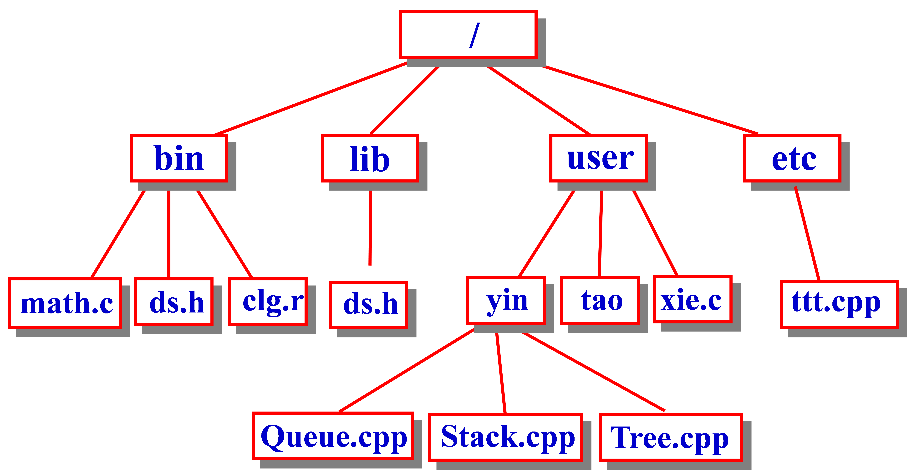
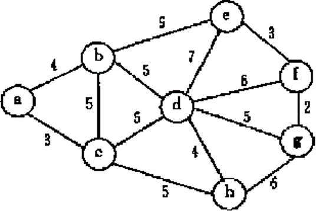

# week8

程序填空题及主观题参考答案在 [ANSWERS.md](ANSWERS.md) 中，编程题参考答案为同目录下的 `.cpp` 文件。

<!-- TOC -->

- [编程题](#编程题)
  - [8.1 层序遍历二叉树](#81-层序遍历二叉树)
  - [8.2 哈夫曼编码](#82-哈夫曼编码)
  - [8.3 列出叶结点](#83-列出叶结点)
  - [8.4 顺序存储的二叉树的最近的公共祖先问题](#84-顺序存储的二叉树的最近的公共祖先问题)
  - [8.5 文件目录显示](#85-文件目录显示)
- [主观题](#主观题)
  - [Problem 1](#problem-1)
  - [Problem 2](#problem-2)
  - [Problem 3](#problem-3)

<!-- /TOC -->

## 编程题

### 8.1 层序遍历二叉树
已知二叉树的先序序列，输出层序遍历序列。

输入格式:  
输入在一行中给出二叉树的先序序列。 `*` 表示空格

输出格式:  
输出共一行，是二叉树的层序遍历序列。

输入样例:
```
ABC**DE*G**F***
```
输出样例:
```
ABCDEFG
```

### 8.2 哈夫曼编码
建立二叉树，输出每个字母的哈夫曼编码。

输入格式:  
输入共3行:  
第一行中给出字符集大小 `n`  
第二行给出每个字母出现的概率(用整数表示)，第三行是一个字符串，表示 `n` 个字母

输出格式:  
输出共n行，给出每个字母的编码。

输入样例:
```
8
5 29 7 8 14 23 3 11
abcdefgh
```
输出样例:
```
a:0001
b:10
c:1110
d:1111
e:110
f:01
g:0000
h:001
```

### 8.3 列出叶结点
对于给定的二叉树，本题要求你按从上到下、从左到右的顺序输出其所有叶节点。

输入格式:  
首先第一行给出一个正整数 `N(≤10)` ，为树中结点总数。树中的结点从 `0` 到 `N−1` 编号。随后 `N` 行，每行给出一个对应结点左右孩子的编号。如果某个孩子不存在，则在对应位置给出 `-` 。编号间以 `1` 个空格分隔。

输出格式:  
在一行中按规定顺序输出叶节点的编号。编号间以 `1` 个空格分隔，行首尾不得有多余空格。

输入样例:
```
8
1 -
- -
0 -
2 7
- -
- -
5 -
4 6
```
输出样例:
```
4 1 5
```

### 8.4 顺序存储的二叉树的最近的公共祖先问题
设顺序存储的二叉树中有编号为 `i` 和 `j` 的两个结点，请设计算法求出它们最近的公共祖先结点的编号和值。

输入格式:  
输入第1行给出正整数 `n(≤1000)` ，即顺序存储的最大容量；第2行给出 `n` 个非负整数，其间以空格分隔。其中 `0` 代表二叉树中的空结点（如果第1个结点为 `0` ，则代表一棵空树）；第3行给出一对结点编号 `i` 和 `j` 。  
题目保证输入正确对应一棵二叉树，且 `1≤i,j≤n` 。

输出格式:  
如果 `i` 或 `j` 对应的是空结点，则输出 `ERROR: T[x] is NULL` ，其中 `x` 是 `i` 或 `j` 中先发现错误的那个编号；否则在一行中输出编号为 `i` 和 `j` 的两个结点最近的公共祖先结点的编号和值，其间以1个空格分隔。

输入样例1:
```
15
4 3 5 1 10 0 7 0 2 0 9 0 0 6 8
11 4
```
输出样例1:
```
2 3
```
输入样例2:
```
15
4 3 5 1 0 0 7 0 2 0 9 0 0 6 8
12 8
```
输出样例2:
```
ERROR: T[12] is NULL
```

### 8.5 文件目录显示
请用树形结构表示文件目录。其中 `*` 表示为目录， `*/` 表示根下的目录，其他为文件。  
用 `**` 表示输入结束，每一级目录用 `%-12s` 输出。



假设目录个数不超过50个，文件或目录名不超过11个字符

输入样例:
```
*/bin
(math.c ds.h  clg.r)
*/lib
(ds.h)
*/user
(*yin *tao xie.c)
(Queue.cpp Stack.cpp Tree.cpp)( )
*/etc
(ttt.cpp)
**
```
输出样例:
```
|-*/        
|-          */bin       
|-          |-          math.c      
|-          |-          ds.h        
|-          |-          clg.r       
|-          */lib       
|-          |-          ds.h        
|-          */user      
|-          |-          *yin        
|-          |-          |-          Queue.cpp   
|-          |-          |-          Stack.cpp   
|-          |-          |-          Tree.cpp    
|-          |-          *tao        
|-          |-          xie.c       
|-          */etc       
|-          |-          ttt.cpp     
```

## 主观题

### Problem 1
图的邻接矩阵如下图，试分别画出自顶点1出发进行遍历所得的深度优先生成树和广度优先生成树。
||1|2|3|4|5|6|7|8|9|10|
|-|-|-|-|-|-|-|-|-|-|-|
|**1**|0|0|0|0|0|0|1|0|1|0|
|**2**|0|0|1|0|0|0|1|0|0|0|
|**3**|0|0|0|1|0|0|0|1|0|0|
|**4**|0|0|0|0|1|0|0|0|1|0|
|**5**|0|0|0|0|0|1|0|0|0|1|
|**6**|1|1|0|0|0|0|0|0|0|0|
|**7**|0|0|1|0|0|0|0|0|0|1|
|**8**|1|0|0|1|0|0|0|0|1|0|
|**9**|0|0|0|0|1|0|1|0|0|1|
|**10**|1|0|0|0|0|1|0|0|0|0|

### Problem 2
请对下图的无向带权图:  
(1) 假设图采用邻接矩阵结构存储，按普里姆算法求其最小生成树。要求画出类似图7.17的表格；  
(2) 假设图采用邻接表结构存储，请按克鲁斯卡尔算法求其最小生成树(画类似图7.18那样的图)。



### Problem 3
图采用邻接表存储结构，请实现图的基本操作:
```c++
int LocateVex(ALGraph G, VertexType u);
int NextAdjVex(ALGraph G, VertexType v, VertexType w);
//返回v的(相对于w的)下一个邻接顶点的序号
//若w是v的最后一个邻接点，则返回-1
```