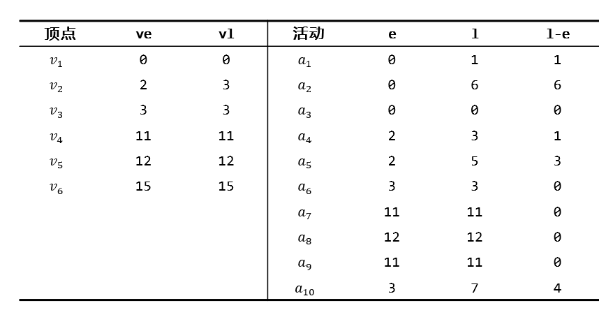

# week9 - 程序填空题和主观题参考答案

## 程序填空题
1. 1. `strcmp(G.vexs[i], u) == 0`
   2. `&G.vexnum`
   3. `&G.arcnum`
   4. `G.vexs[i]`
   5. `LocateVex(G, va)`
   6. `LocateVex(G, vb)`
   7. `LocateVex(G, v)`
   8. `strcpy(G.vexs[k], value)`
   9. `LocateVex(G, v)`
   10. `G.arcs[i][k] == 1`
   11. `LocateVex(G, v)`
   12. `LocateVex(G, w)`
   13. `k2+1`
   14. `G.arcs[i][k1] == 1`
   15. `G.arcs[G.vexnum][i]`
   16. `G.arcs[i][G.vexnum]`
   17. `G.vexnum++`
   18. `G.arcnum--`
   19. `strcpy(G.vexs[j-1], G.vexs[j])`
   20. `j=k+1;j<G.vexnum;j++`
   21. `j=k+1;j<G.vexnum;j++`
   22. `G.vexnum--`
   23. `LocateVex(G, v)`
   24. `LocateVex(G, w)`
   25. `G.arcnum++`
   26. `G.arcs[v1][w1] = G.arcs[w1][v1] = 1`
   27. `LocateVex(G, v)`
   28. `LocateVex(G, w)`
   29. `G.arcs[v1][w1] = G.arcs[w1][v1]`
   30. `G.arcnum--`

## 主观题

### Problem 1
全部可能的拓扑序列如下
```
1 5 2 3 6 4
1 5 2 6 3 4
1 5 6 2 3 4
5 1 2 3 6 4
5 1 2 6 3 4
5 1 6 2 3 4
5 6 1 2 3 4
```
存储结构采用如下邻接表


根据书中Topological Sort算法求得的序列为
```
5 6 1 2 3 4
```

### Problem 2



关键路径分别为下图(a)(b)


### Problem 3

