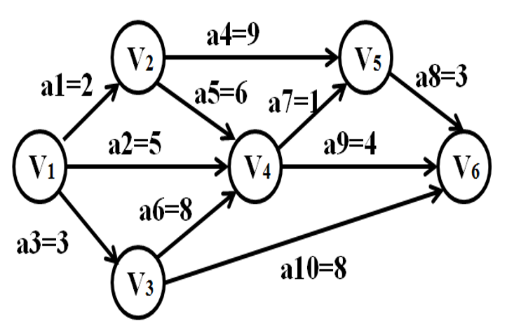

# week9

程序填空题及主观题参考答案在 [ANSWERS.md](ANSWERS.md) 中，编程题参考答案为同目录下的 `.cpp` 文件。

<!-- TOC -->

- [程序填空题](#程序填空题)
  - [Problem 1](#problem-1)
- [编程题](#编程题)
  - [无向图的深度优先遍历](#无向图的深度优先遍历)
  - [拯救007](#拯救007)
- [主观题](#主观题)
  - [Problem 1](#problem-1-1)
  - [Problem 2](#problem-2)
  - [Problem 3](#problem-3)

<!-- /TOC -->

## 程序填空题

### Problem 1
无向图采用邻接矩阵结构存储，本题要求实现无向图的基本操作，请填空。
```c++
#include <stdio.h>
#include <string.h>

// 图的数组(邻接矩阵)存储表示
#define MAX_VERTEX_NUM 20 // 最大顶点个数
enum GraphKind{DG,DN,AG,AN}; // {有向图,有向网,无向图,无向网}

typedef char VertexType[6];

// 顶点关系类型。对无权图，用1(是)或0(否)表示相邻否； 对带权图，则为权值类型
typedef int ArcCell,AdjMatrix[MAX_VERTEX_NUM][MAX_VERTEX_NUM];

struct MGraph
{
  VertexType vexs[MAX_VERTEX_NUM]; // 顶点向量
  AdjMatrix arcs; // 邻接矩阵
  int vexnum,arcnum; // 图的当前顶点数和弧数
  GraphKind kind; // 图的种类标志
};

// 图的数组(邻接矩阵)存储基本操作
int LocateVex(MGraph G,VertexType u)
{ // 初始条件:图G存在,u和G中顶点有相同特征
  // 操作结果:若G中存在顶点u,则返回该顶点在图中位置;否则返回-1
  int i;
  for(i=0;i<G.vexnum;++i)
    if(____1____)
      return i;
  return -1;
}

Status CreateAG(MGraph &G)
{ // 采用数组(邻接矩阵)表示法,由文件构造没有相关信息的无向图G
  int i,j,k;
  VertexType va,vb;
  printf("请输入无向图G的顶点数,边数:");
  scanf("%d",____2____);
  scanf("%d",____3____);
  printf("\n请输入%d个顶点的值:\n",G.vexnum);
  for(i=0;i<G.vexnum;++i) // 构造顶点向量
    scanf(" %s", ____4____);
  for(i=0;i<G.vexnum;++i) // 初始化邻接矩阵
    for(j=0;j<G.vexnum;++j)
      G.arcs[i][j]=0;
  printf("请输入%d条边的顶点1 顶点2:\n",G.arcnum);
  for(k=0;k<G.arcnum;++k)
  {
    scanf(" %s%s",va,vb);
    i=____5____;
    j=____6____;
    G.arcs[i][j]=G.arcs[j][i]=1; // 无向图
  }
  G.kind=AG;
  return OK;
}

void DestroyGraph(MGraph &G)
 { // 初始条件: 图G存在。操作结果: 销毁无向图G
   G.vexnum=0;
   G.arcnum=0;
 }

Status PutVex(MGraph &G,VertexType v,VertexType value)
{ // 初始条件: 图G存在，v是G中某个顶点。操作结果: 对v赋新值value
  int k;
  k=____7____; // k为顶点v在图G中的序号
  if(k<0)
    return ERROR;
  ____8____;
  return OK;
}

int FirstAdjVex(MGraph G,VertexType v)
{ // 初始条件: 图G存在,v是G中某个顶点
  // 操作结果: 返回v的第一个邻接顶点的序号。若顶点在G中没有邻接顶点,则返回-1
  int i,j=0,k;
  k=____9____; // k为顶点v在图G中的序号
  for(i=0;i<G.vexnum;i++)
    if(____10____)   //无向图
      return i;
  return -1;
}

int NextAdjVex(MGraph G,VertexType v,VertexType w)
{ // 初始条件: 图G存在,v是G中某个顶点,w是v的邻接顶点
  // 操作结果: 返回v的(相对于w的)下一个邻接顶点的序号,
  //           若w是v的最后一个邻接顶点,则返回-1
  int i,j=0,k1,k2;
  k1=____11____; // k1为顶点v在图G中的序号
  k2=____12____; // k2为顶点w在图G中的序号
  for(i=____13____;i<G.vexnum;i++)
    if(____14____)
      return i;
  return -1;
}

void InsertVex(MGraph &G,VertexType v)
{ // 初始条件: 图G存在,v和图G中顶点有相同特征
  // 操作结果: 在图G中增添新顶点v(不增添与顶点相关的弧,留待InsertArc()去做)
  int i;
  strcpy(G.vexs[G.vexnum],v); // 构造新顶点向量
  for(i=0;i<=G.vexnum;i++)
  {
    ____15____=0; // 初始化该行邻接矩阵的值(无边或弧)
    ____16____=0; // 初始化该列邻接矩阵的值(无边或弧)
  }
____17____; // 图G的顶点数加1
}

Status DeleteVex(MGraph &G,VertexType v)
{ // 初始条件: 图G存在,v是G中某个顶点。操作结果: 删除G中顶点v及其相关的弧
  int i,j,k;
  k=LocateVex(G,v); // k为待删除顶点v的序号
  if(k<0) // v不是图G的顶点
    return ERROR;
  for(j=0;j<G.vexnum;j++)
    if(G.arcs[j][k]!=0) // 有边
      ____18____; // 修改边数
  for(j=k+1;j<G.vexnum;j++) // 序号k后面的顶点向量依次前移
    ____19____;
  for(i=0;i<G.vexnum;i++)
    for(____20____)
      G.arcs[i][j-1]=G.arcs[i][j]; // 移动待删除顶点之后的矩阵元素
  for(i=0;i<G.vexnum;i++)
    for(____21____)
      G.arcs[j-1][i]=G.arcs[j][i]; // 移动待删除顶点之下的矩阵元素
  ____22____; // 更新图的顶点数
  return OK;
}

Status InsertArc(MGraph &G,VertexType v,VertexType w)
{ // 初始条件: 图G存在,v和W是G中两个顶点
  // 操作结果: 在G中增添弧<v,w>,若G是无向的,则还增添对称弧<w,v>
  int i,l,v1,w1;
  v1=____23____; // 尾
  w1=____24____; // 头
  if(v1<0||w1<0)
    return ERROR;
  ____25____; // 弧或边数加1
  ____26____;
  return OK;
}

Status DeleteArc(MGraph &G,VertexType v,VertexType w)
{ // 初始条件: 图G存在,v和w是G中两个顶点
  // 操作结果: 在G中删除弧<v,w>,若G是无向的,则还删除对称弧<w,v>
  int v1,w1;
  v1=____27____; // 尾
  w1=____28____; // 头
  if(v1<0||w1<0) // v1、w1的值不合法
    return ERROR;
  ____29____=0;
  ____30____;    //修改边数
  return OK;
}
void Display(MGraph G)
{ // 输出无向图G
  int i,j;
  printf("%d个顶点%d条边的无向图\n",G.vexnum,G.arcnum);
  for(i=0;i<G.vexnum;++i) // 输出G.vexs
    printf("G.vexs[%d]=%s\n",i,G.vexs[i]);
  printf("G.arcs:\n"); // 输出G.arcs.adj
  for(i=0;i<G.vexnum;i++)
  {
    for(j=0;j<G.vexnum;j++)
      printf("%2d",G.arcs[i][j]);
    printf("\n");
  }
}

int main()
{
  int i,j,k,n;
  VertexType v1,v2;
  MGraph g;
  CreateAG(g);
  Display(g);
  printf("修改顶点的值，请输入原值 新值: \n");
  scanf("%s%s",v1,v2);
  PutVex(g,v1,v2);
  printf("删除一条边或弧，请输入待删除边或弧的弧尾 弧头：\n");
  scanf("%s%s",v1,v2);
  DeleteArc(g,v1,v2);
  Display(g);
  printf("插入新顶点，请输入顶点的值: ");
  scanf("%s",v1);
  InsertVex(g,v1);
  printf("\n插入与新顶点有关的边，请输入边数: ");
  scanf("%d",&n);
  for(k=0;k<n;k++)
    {
      printf("\n请输入另一顶点的值: ");
      scanf("%s",v2);
      InsertArc(g,v1,v2);
    }
  printf("\n");
  Display(g);
  printf("删除顶点及相关边，请输入顶点的值: ");
  scanf("%s",v1);
  printf("\n");
  DeleteVex(g,v1);
  Display(g);
  DestroyGraph(g);
  return 0;
}
```
输入示例:
```
8 9
v1
v2
v3
v4
v5
v6
v7
v8
v1 v2
v1 v3
v2 v4
v2 v5
v3 v6
v3 v7
v4 v8
v5 v8
v6 v7
v8 v9
v1 v3
v10
5
v1
v5
v7
v9
v2
v10
```
输出示例:
```
请输入无向图G的顶点数,边数:
请输入8个顶点的值:
请输入9条边的顶点1 顶点2:
8个顶点9条边的无向图
G.vexs[0]=v1
G.vexs[1]=v2
G.vexs[2]=v3
G.vexs[3]=v4
G.vexs[4]=v5
G.vexs[5]=v6
G.vexs[6]=v7
G.vexs[7]=v8
G.arcs:
 0 1 1 0 0 0 0 0
 1 0 0 1 1 0 0 0
 1 0 0 0 0 1 1 0
 0 1 0 0 0 0 0 1
 0 1 0 0 0 0 0 1
 0 0 1 0 0 0 1 0
 0 0 1 0 0 1 0 0
 0 0 0 1 1 0 0 0
修改顶点的值，请输入原值 新值: 
删除一条边或弧，请输入待删除边或弧的弧尾 弧头：
8个顶点8条边的无向图
G.vexs[0]=v1
G.vexs[1]=v2
G.vexs[2]=v3
G.vexs[3]=v4
G.vexs[4]=v5
G.vexs[5]=v6
G.vexs[6]=v7
G.vexs[7]=v9
G.arcs:
 0 1 0 0 0 0 0 0
 1 0 0 1 1 0 0 0
 0 0 0 0 0 1 1 0
 0 1 0 0 0 0 0 1
 0 1 0 0 0 0 0 1
 0 0 1 0 0 0 1 0
 0 0 1 0 0 1 0 0
 0 0 0 1 1 0 0 0
插入新顶点，请输入顶点的值: 
插入与新顶点有关的边，请输入边数: 
请输入另一顶点的值: 
请输入另一顶点的值: 
请输入另一顶点的值: 
请输入另一顶点的值: 
请输入另一顶点的值: 
9个顶点13条边的无向图
G.vexs[0]=v1
G.vexs[1]=v2
G.vexs[2]=v3
G.vexs[3]=v4
G.vexs[4]=v5
G.vexs[5]=v6
G.vexs[6]=v7
G.vexs[7]=v9
G.vexs[8]=v10
G.arcs:
 0 1 0 0 0 0 0 0 1
 1 0 0 1 1 0 0 0 1
 0 0 0 0 0 1 1 0 0
 0 1 0 0 0 0 0 1 0
 0 1 0 0 0 0 0 1 1
 0 0 1 0 0 0 1 0 0
 0 0 1 0 0 1 0 0 1
 0 0 0 1 1 0 0 0 1
 1 1 0 0 1 0 1 1 0
删除顶点及相关边，请输入顶点的值: 
8个顶点8条边的无向图
G.vexs[0]=v1
G.vexs[1]=v2
G.vexs[2]=v3
G.vexs[3]=v4
G.vexs[4]=v5
G.vexs[5]=v6
G.vexs[6]=v7
G.vexs[7]=v9
G.arcs:
 0 1 0 0 0 0 0 0
 1 0 0 1 1 0 0 0
 0 0 0 0 0 1 1 0
 0 1 0 0 0 0 0 1
 0 1 0 0 0 0 0 1
 0 0 1 0 0 0 1 0
 0 0 1 0 0 1 0 0
 0 0 0 1 1 0 0 0
```
注意: 输入输出是交替进行的，需要配合着看，以下是一次执行过程:
```
请输入无向图G的顶点数,边数:8 9

请输入8个顶点的值:
v1
v2
v3
v4
v5
v6
v7
v8
请输入9条边的顶点1 顶点2:
v1 v2
v1 v3
v2 v4
v2 v5
v3 v6
v3 v7
v4 v8
v5 v8
v6 v7
8个顶点9条边的无向图
G.vexs[0]=v1
G.vexs[1]=v2
G.vexs[2]=v3
G.vexs[3]=v4
G.vexs[4]=v5
G.vexs[5]=v6
G.vexs[6]=v7
G.vexs[7]=v8
G.arcs:
 0 1 1 0 0 0 0 0
 1 0 0 1 1 0 0 0
 1 0 0 0 0 1 1 0
 0 1 0 0 0 0 0 1
 0 1 0 0 0 0 0 1
 0 0 1 0 0 0 1 0
 0 0 1 0 0 1 0 0
 0 0 0 1 1 0 0 0
修改顶点的值，请输入原值 新值:
v8 v9
删除一条边或弧，请输入待删除边或弧的弧尾 弧头：
v1 v3
8个顶点8条边的无向图
G.vexs[0]=v1
G.vexs[1]=v2
G.vexs[2]=v3
G.vexs[3]=v4
G.vexs[4]=v5
G.vexs[5]=v6
G.vexs[6]=v7
G.vexs[7]=v9
G.arcs:
 0 1 0 0 0 0 0 0
 1 0 0 1 1 0 0 0
 0 0 0 0 0 1 1 0
 0 1 0 0 0 0 0 1
 0 1 0 0 0 0 0 1
 0 0 1 0 0 0 1 0
 0 0 1 0 0 1 0 0
 0 0 0 1 1 0 0 0
插入新顶点，请输入顶点的值: v10

插入与新顶点有关的边，请输入边数: 5

请输入另一顶点的值: v1

请输入另一顶点的值: v5

请输入另一顶点的值: v7

请输入另一顶点的值: v9

请输入另一顶点的值: v2

9个顶点13条边的无向图
G.vexs[0]=v1
G.vexs[1]=v2
G.vexs[2]=v3
G.vexs[3]=v4
G.vexs[4]=v5
G.vexs[5]=v6
G.vexs[6]=v7
G.vexs[7]=v9
G.vexs[8]=v10
G.arcs:
 0 1 0 0 0 0 0 0 1
 1 0 0 1 1 0 0 0 1
 0 0 0 0 0 1 1 0 0
 0 1 0 0 0 0 0 1 0
 0 1 0 0 0 0 0 1 1
 0 0 1 0 0 0 1 0 0
 0 0 1 0 0 1 0 0 1
 0 0 0 1 1 0 0 0 1
 1 1 0 0 1 0 1 1 0
删除顶点及相关边，请输入顶点的值: v10

8个顶点8条边的无向图
G.vexs[0]=v1
G.vexs[1]=v2
G.vexs[2]=v3
G.vexs[3]=v4
G.vexs[4]=v5
G.vexs[5]=v6
G.vexs[6]=v7
G.vexs[7]=v9
G.arcs:
 0 1 0 0 0 0 0 0
 1 0 0 1 1 0 0 0
 0 0 0 0 0 1 1 0
 0 1 0 0 0 0 0 1
 0 1 0 0 0 0 0 1
 0 0 1 0 0 0 1 0
 0 0 1 0 0 1 0 0
 0 0 0 1 1 0 0 0
```

## 编程题

### 无向图的深度优先遍历
无向图(网)采用邻接矩阵结构。假设总是从第一个顶点出发遍历。顶点个数不超过30个。

输入格式:  
输入共3部分，依次给出图中顶点的个数、顶点信息和邻接矩阵。

输出格式:  
输出是遍历序列，用 `%s ` 输出一个顶点(包含一个空格)。

输入样例:
```
8
v1
v2
v3
v4
v5
v6
v7
v8
0 1 1 0 0 0 0 0
1 0 0 1 1 0 0 0
1 0 0 0 0 1 1 0
0 1 0 0 0 0 0 1
0 1 0 0 0 0 0 1
0 0 1 0 0 0 1 0
0 0 1 0 0 1 0 0
0 0 0 1 1 0 0 0
```
输出样例:
```
v1 v2 v4 v8 v5 v3 v6 v7 
```

### 拯救007
在老电影“007之生死关头”(Live and Let Die)中有一个情节，007被毒贩抓到一个鳄鱼池中心的小岛上，他用了一种极为大胆的方法逃脱 —— 直接踩着池子里一系列鳄鱼的大脑袋跳上岸去！(据说当年替身演员被最后一条鳄鱼咬住了脚，幸好穿的是特别加厚的靴子才逃过一劫。)

设鳄鱼池是长宽为100米的方形，中心坐标为 `(0, 0)` ，且东北角坐标为 `(50, 50)` 。池心岛是以 `(0, 0)` 为圆心、直径 `15` 米的圆。给定池中分布的鳄鱼的坐标、以及007一次能跳跃的最大距离，你需要告诉他是否有可能逃出生天。

输入格式:  
首先第一行给出两个正整数：鳄鱼数量 `N (≤100)` 和007一次能跳跃的最大距离 `D`。随后 `N` 行，每行给出一条鳄鱼的 `(x,y)` 坐标。注意：不会有两条鳄鱼待在同一个点上。

输出格式:  
如果007有可能逃脱，就在一行中输出 `Yes` ，否则输出 `No` 。

输入样例 1:
```
14 20
25 -15
-25 28
8 49
29 15
-35 -2
5 28
27 -29
-8 -28
-20 -35
-25 -20
-13 29
-30 15
-35 40
12 12
```
输出样例 1:
```
Yes
```
输入样例 2:
```
4 13
-12 12
12 12
-12 -12
12 -12
```
输出样例 2:
```
No
```

## 主观题

### Problem 1
试列出题7.9图中全部可能的拓扑有序序列，并指出应用7.5.1节中算法Topological Sort求得的是哪一个序列(注意: 物理结构是什么)

### Problem 2
对于下图所示的AOE网络，计算各活动弧的 `e(ai)` 和 `l(ai)` 函数值、各事件(顶点)的 `ve(vi)` 和 `vl(vi)` 函数值(即画出书上186页图7.31所示的表)，列出各条关键路径。



### Problem 3
试利用Dijkstra算法求题7.11图中从顶点a到其他各顶点间的最短路径，写出执行算法过程中各步的状态(即画出书上190页的表格)。