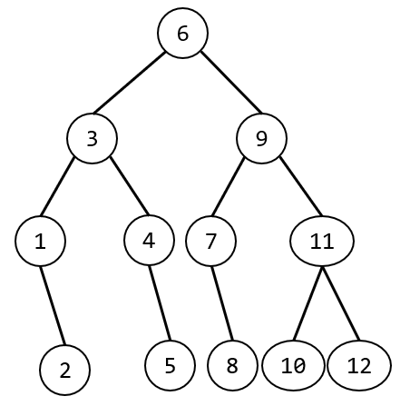
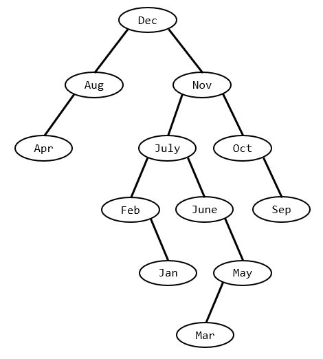
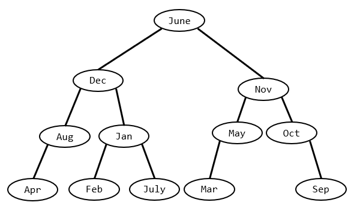
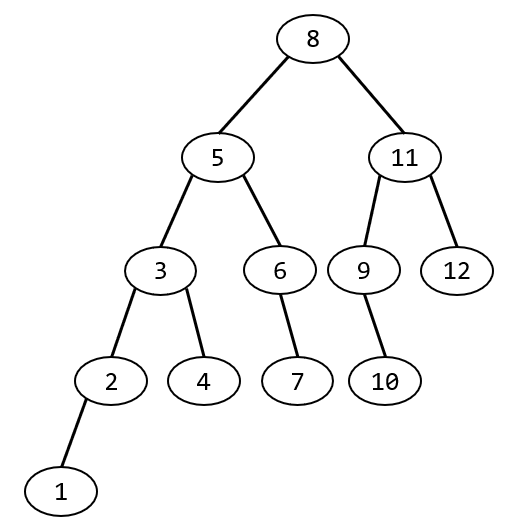

# week10 - 程序填空题和主观题参考答案

## 程序填空题
1. 1. `strcmp(G.vertices[i].data, u) == 0`
   2. `&G.vexnum, &G.arcnum`
   3. `0`
   4. `LocateVex(G, va)`
   5. `LocateVex(G, vb)`
   6. `j`
   7. `w`
   8. `G.vertices[i].firstarc`
   9. `p`
   10. `G.vertices[i].firstarc`
   11. `p->nextarc`
   12. `LocateVex(G, v)`
   13. `strcpy(G.vertices[i].data, value)`
   14. `LocateVex(G, v)`
   15. `G.vertices[v1].firstarc`
   16. `p->adjvex`
   17. `LocateVex(G, v)`
   18. `LocateVex(G, w)`
   19. `p && p->adjvex != w1`
   20. `p->nextarc->adjvex`
   21. `G.vertices[G.vexnum].firstarc = NULL`
   22. `G.vexnum++`
   23. `LocateVex(G, v)`
   24. `G.vertices[j].firstarc`
   25. `q=p`
   26. `G.arcnum--`
   27. `G.vexnum--`
   28. `i=j`
   29. `G.vertices[i].firstarc=p->nextarc`
   30. `G.vertices[i].firstarc`
   31. `q=p`
   32. `q->nextarc`
   33. `p->adjvex > j`
   34. `LocateVex(G, v)`
   35. `LocateVex(G, w)`
   36. `j`
   37. `w1`
   38. `G.vertices[i].firstarc`
   39. `p`
   40. `LocateVex(G, v)`
   41. `LocateVex(G, w)`
   42. `p && p->adjvex != j`
   43. `p && p->adjvex==j`
   44. `G.vertices[i].firstarc = p->nextarc`
   45. `q->nextarc = p->nextarc`

## 主观题

### Problem 1
所求判定树如下

ASL成功=37/12

### Problem 2
(1) 二叉搜索树如下

ASL成功=7/2

(2) 平衡二叉搜索树如下

ASL成功=37/12

### Problem 3
其最大深度为5，下图为其中可能的一种情况

