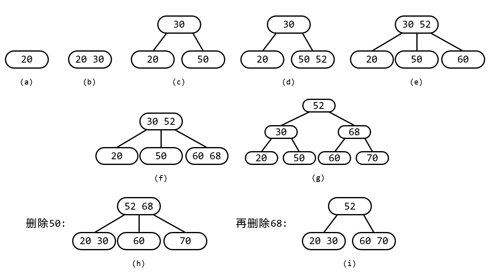
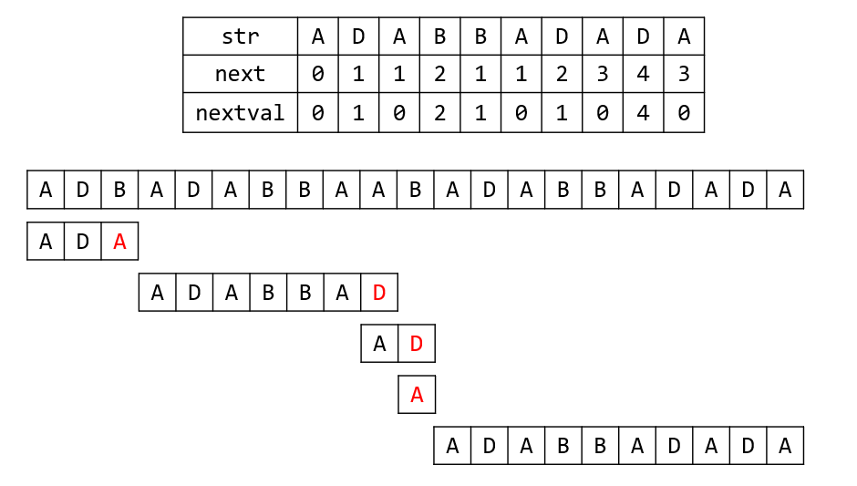

# week11 - 主观题参考答案

## 主观题

### Problem 1
参见下图



### Problem 2
最多有8个非叶子结点，见下图(a)或(b).



### Problem 3
```c++
#include <cstdio>
#include <cstdlib>

typedef int ElemType;
const int inf = 0x3f3f3f3f;

typedef struct BiTNode{
  ElemType data;
  struct BiTNode *left, *right;
} *BiTree;

bool isAVL(BiTree T){
  static ElemType lastNode=-inf;
  if(T){
    bool ret = isAVL(T->left);
    ret = ret && lastNode < T->data;
    lastNode = T->data;
    ret = ret && isAVL(T->right);
    return ret;
  }
  return true;
}

bool createBiTree(BiTree &src){
	ElemType in;
	scanf("%c", &in);
	if(in == '*'){
		src = NULL;
	}else{
		src = (BiTNode *)malloc(sizeof(BiTNode));
		src->data = in;
		createBiTree(src->left);
		createBiTree(src->right);
	}
	return true;
}

int main(){
  BiTree T;
  createBiTree(T); // 421**3**65**7**
  printf("%d", isAVL(T));
  return 0;
}
```
