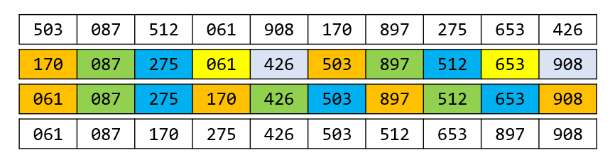

# week12 - 主观题参考答案

## 主观题

### Problem 1
| 下标 | 0    | 1    | 2    | 3    | 4    | 5    | 6    | 7    | 8    | 9    | 10   |
| ---- | ---- | ---- | ---- | ---- | ---- | ---- | ---- | ---- | ---- | ---- | ---- |
| 序列 | 22   |      | 41   | 30   |      | 53   | 46   |      | 13   |      | 01   |

ASL成功=(1+1+1+1+2+2+6)/7=2

### Problem 2
(1) 直接插入排序  

(2) 希尔排序(增量序列为 `5, 3, 1` )  

(3) 快速排序  
