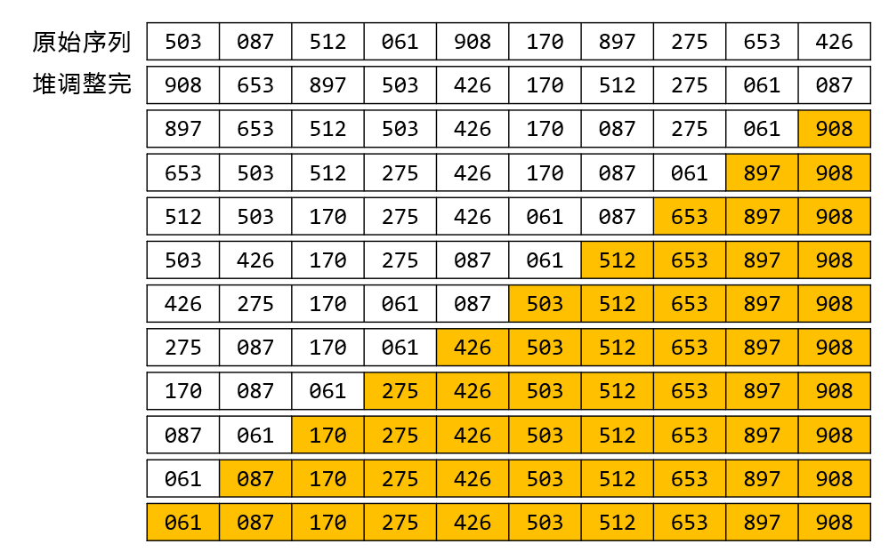
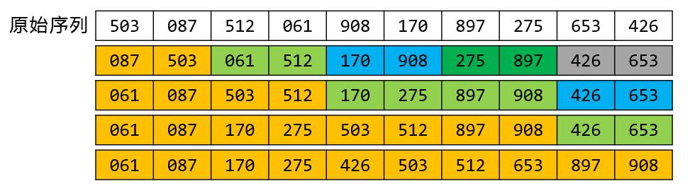
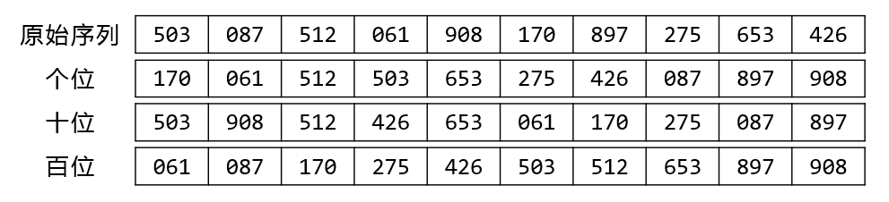

# week13 - 程序填空题和主观题参考答案

## 程序填空题
1. 1. `2`
   2. `L.r[i]`
   3. `L.r[j+1]=L.r[j]`
   4. `L.r[j+1]=L.r[0]`
2. 1. `dk+1`
   2. `L.r[i-dk].key`
   3. `L.r[i]`
   4. `i-dk`
   5. `j-=dk`
   6. `L.r[j+dk]=L.r[j]`
   7. `L.r[j+dk]`
3. 1. `L.r[low]`
   2. `L.r[low].key`
   3. `low<high && L.r[high].key>=pivotkey`
   4. `low<high && L.r[low].key<=pivotkey`
   5. `L.r[low]=L.r[0]`
   6. `low`
   7. `L, low, pivotloc-1`
   8. `L, pivotloc+1, high`

## 主观题

### Problem 1


### Problem 2


### Problem 3


### Problem 4
```
t=THESE ARE BOOKS,v=YXY,u=XWXWXW
```