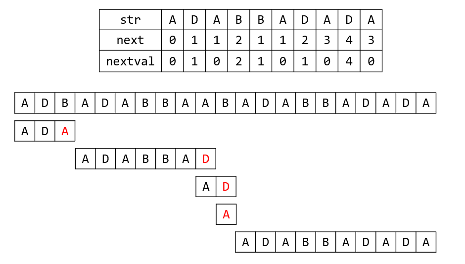

# week14 - 程序填空题和主观题参考答案

## 程序填空题
1. 1. `2*s`
   2. `j*=2`
   3. `j<m && LT(H.r[j].key, H.r[j+1].key)`
   4. `H.r[s]=H.r[j]`
   5. `H.r[s]=rc`
   6. `H.length/2`
   7. `H.length`
   8. `H.r[i]`
   9. `H.r[i]`
   10. `HeapAdjust(H, 1, i-1)`

## 主观题

### Problem 1
