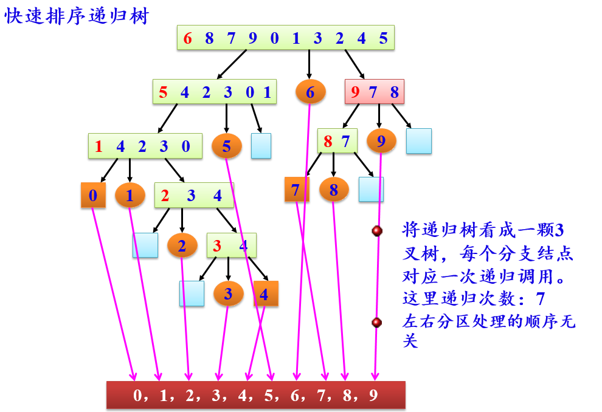

# week14

程序填空题及主观题参考答案在 [ANSWERS.md](ANSWERS.md) 中，编程题参考答案为同目录下的 `.cpp` 文件。

<!-- TOC -->

- [程序填空题](#程序填空题)
  - [Problem 1](#problem-1)
- [编程题](#编程题)
  - [快速排序](#快速排序)
  - [双向冒泡排序](#双向冒泡排序)
  - [寻找大富翁](#寻找大富翁)
- [主观题](#主观题)
  - [Problem 1](#problem-1-1)

<!-- /TOC -->

## 程序填空题

### Problem 1
本题目要求实现堆排序算法，将一组数据从小到大排序,请填空。
```c++
typedef SqList HeapType; // 堆采用顺序表存储表示

 void HeapAdjust(HeapType &H,int s,int m) // 算法10.10
 { // 已知H.r[s..m]中记录的关键字除H.r[s].key之外均满足堆的定义，本函数
   // 调整H.r[s]的关键字,使H.r[s..m]成为一个大顶堆(对其中记录的关键字而言)
   RedType rc;
   int j;
   rc=H.r[s];
   for(j= ____1____ ;  j<=m; ____2____ )
   { 
     if( ____3____ )
       ++j; // j为key较大的记录的下标
     if(!LT(rc.key,H.r[j].key))
       break; // rc应插入在位置s上
     ____4____ ;
     s=j ;
   }
  ____5____; // 插入
 }

 void HeapSort(HeapType &H)
 { // 对顺序表H进行堆排序。算法10.11
   RedType t;
   int i;
   for(i=____6____ ;  i>0 ;  --i  ) // 把H.r[1..H.length]建成大顶堆
     HeapAdjust(H,i,H.length);
   for(i= ____7____ ; i>1  ;  --i  )
   { 
     t=H.r[1];
     H.r[1]=____8____ ;
     ____9____ =t;
     ____10____ ; // 将H.r[1..i-1]重新调整为大顶堆
   }
 }
```

## 编程题

### 快速排序
假设每次用第一个关键字做枢轴，请实现快速排序算法。关键字个数不超过500个。



输入格式:  
输入共2行，第一行是关键字的个数，第二行给出所有的关键字。

输出格式:  
输出共2行，分别输出排序过程中用到的枢轴记录和排序后的结果，每个关键字用 `%4d` 输出。

输入样例:
```
10
6 8 7 9 0 1 3 2 4 5
```
输出样例:
```
   6   5   1   2   3   9   8
   0   1   2   3   4   5   6   7   8   9
```

### 双向冒泡排序
本题要求改写冒泡排序算法：奇数趟从左到右，偶数趟从右到左。整个排序从第1趟开始。关键字个数不超过500个。

输入格式:  
输入数据是关键字个数及所有关键字

输出格式:  
输出排序过程中记录交换的次数和排序后的结果。所有数据都用 `%4d` 格式输出。

输入样例:
```
5
5 4 3 2 1
```
输出样例:
```
  10
   1   2   3   4   5
```

### 寻找大富翁
胡润研究院的调查显示，截至2017年底，中国个人资产超过1亿元的高净值人群达15万人。假设给出 `N` 个人的个人资产值，请快速找出资产排前 `M` 位的大富翁。

输入格式:
输入首先给出两个正整数 `N` (≤10<sup>6</sup>) 和 `M` (≤10) ，其中 `N` 为总人数， `M` 为需要找出的大富翁数；接下来一行给出 `N` 个人的个人资产值，以百万元为单位，为不超过长整型范围的整数。数字间以空格分隔。

输出格式:
在一行内按非递增顺序输出资产排前 `M` 位的大富翁的个人资产值。数字间以空格分隔，但结尾不得有多余空格。

输入样例:
```
8 3
8 12 7 3 20 9 5 18
```
输出样例:
```
20 18 12
```

## 主观题

### Problem 1
已知主串 `s = "ADBADABBAABADABBADADA"` ，模式串 `pat = "ADABBADADA"` ，写出模式串的 `nextval` 函数值，并由此画出KMP算法匹配的全过程。